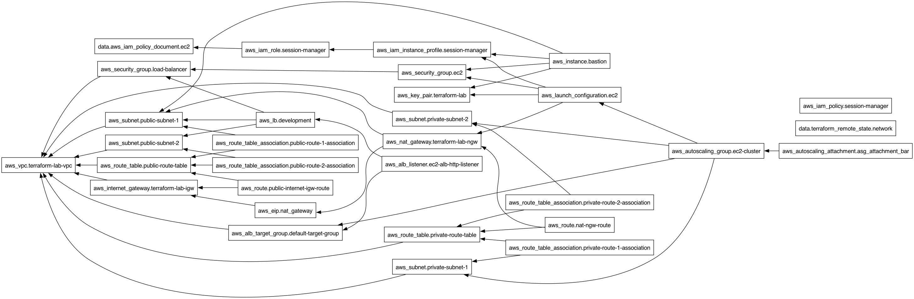

# Flask App Pipeline
This repository contains a Flask web application enhanced with database interaction, authentication, rate limiting, and integrated with a CI/CD pipeline using GitHub Actions.

### Features
- Database Integration: Uses SQLite for storing user data.
- Authentication: Basic HTTP authentication for protecting routes.
- Rate Limiting: Limits the number of requests to prevent abuse.
- CI/CD Pipeline: Integrated with GitHub Actions for continuous integration and deployment.

### Setup Instructions
Prerequisites
- Python 3.8 or higher
- Docker and Docker Compose
- Git
- SonarCloud (SonarQube) Access

### Local Development

#### 1. Run the Application locally
Clone the repository:
```
git clone https://github.com/talitz/flask-app-prod-pipeline.git
cd flask-app-prod-pipeline
```

#### Create a virtual environment:
```
python3 -m venv venv
source venv/bin/activate
```

#### Install dependencies:
```pip install -r requirements.txt``` 

#### Set up environment variables:
Copy the example environment file and adjust the variables as needed.

#### Run the application:
```python3 -m flask --app src run --port 5000 --debug```

The application will be available at http://127.0.0.1:5000.

#### 2. Local Development using Docker

To build the Docker image for the Flask application, navigate to the root directory of the project where the Dockerfile is located and run the following command:

```
TAG=$(date +'%Y%m%d%H%M%S')
docker build -t flask-app:dev-$TAG .
```

This command will build a Docker image named flask-app based on the instructions in the Dockerfile.
It's not recommended to use the 'latest' tag.

Once the image is built, you can run the container using the following command:

```docker run -p 5001:5000 flask-app:dev-$TAG```

This command starts the container and maps port 5000 inside the container to port 5001 on your local machine.

You can access the Flask application by navigating to the following URL in your web browser: http://127.0.0.1:5001/

#### 3. Local Development using Docker Compose

Building can be done:
```docker-compose up --build```

Now, you can access the Flask application by navigating to the following URL in your web browser: http://localhost/

For spinning down all containers:
```docker-compose down```

#### 4. GitHub Actions Pipeline Automation

The automation is created on PR merge to 'main', and runs the following steps:


#### 5. Use SonarQube for Static Code Analysis to Improve Code Quality:
Ask for a user / login via SSO to https://sonarcloud.io/ to 'flask-app' dashboard on 'main' branch to resolve Issues, Security Hotspots, Coverage, Duplications, etc. 


### AWS Infrastructure

The infrastructure is deployed using terraform:
- VPC with two public subnets and two private subnets in two different availability zones for high-availability.
- Internet Gateway for internet traffic.
- NAT Gateway to the private subnets, so the private subnets can connect to the internet.
- Autoscaling group and launch templates to the EC2 Instances.
- Security groups and route tables to enable traffic between subnets, NAT, and Internet Gateways.
- Application Load Balancer for the EC2 auto scaling group.
- Bastion EC2 instance to SSH into the EC2 instances running in private subnets.


Output from terraform graph:
```
brew install graphviz
terraform graph > graph.dot
dot -Tpng graph.dot -o graph.png
```


#### 1. Local Terraform Development

##### Setup Instructions
Prerequisites
- Terraform v1.5.7
- AWS Account
- Chekov 
- Trivy

Configure your AWS Credentials (including the following TF_VAR env vars): 
```
export TF_VAR_aws_key=""                           
export TF_VAR_aws_secret=""
```

Then, run the following commands:
```
terraform init                           
terraform plan
terraform apply
```

Once applied successfully:


Access the deployment via the created ALB (HTTP) on the /health API:


Use Chekov on your terraform plans to identify, early in the development phase; misconfigurations that may lead to security or compliance problems:
```
cd terraform
terraform init
terraform plan --out tfplan.binary
terraform show -json tfplan.binary | jq > tfplan.json
checkov -f tfplan.json
```
Work to prioritize and remediate all issues found by Chekov.
Once done, delete the created files (they won't be commited and will be ignored in git from security purposes):
```
rm tfplan.binary tfplan.json
```

Use Trivy as well (as a complementary solution) to scans all configuration files for misconfiguration issues, as well as for identifying CVEs within the created docker images.
```
trivy fs .
trivy image flask-app
```

From the results, prioritize and solve the CVEs that matter the most (from CRITICAL to LOW):


#### 2. GitHub Actions Pipeline Automation

The automation creates a terraform plan, applies it and test the healthiness of the application on the ALB:


### Project Gaps/Roadmap Plan (better to use Jira/Project Management Solution)

DevOps Related:

Task | Description                                                                                                                                                                   | Priority | Owner |
--- |-------------------------------------------------------------------------------------------------------------------------------------------------------------------------------|----------|-------|
latest tag is used for flask:latest| The existing tag is used for simplification and conveniency; it's not recommended to use latest, therefore proper tagging should be implemented based on semantic versioning. | High     | Tal Yitzhak (yitzhtal@gmail.com)
Chekov, SQ and Trivy are not automated in Pipelines| Security and Static Analysis should run as part of the automations, potentially force security rules and code quality standards.                                              | Medium   | Tal Yitzhak (yitzhtal@gmail.com)
Drifts Management Identification| Create pipeline that alerts and detects drifts, to keep the IaC refreshed to the actual state as much as possible            | Medium   | Tal Yitzhak (yitzhtal@gmail.com)

Code Related

Task | Description                                                                                                                                                                   | Priority | Owner |
--- |-------------------------------------------------------------------------------------------------------------------------------------------------------------------------------|----------|-------|
Externalize the api from __init__.py to routes.py file | Better code would be implementing all routes in a dedicated file  | High     | Tal Yitzhak (yitzhtal@gmail.com)
Admin creds are hardcoded (or coming from env var) | It's better to store them secured and encrypted, not in the code, but from secrets manager or integration | High   | Tal Yitzhak (yitzhtal@gmail.com)